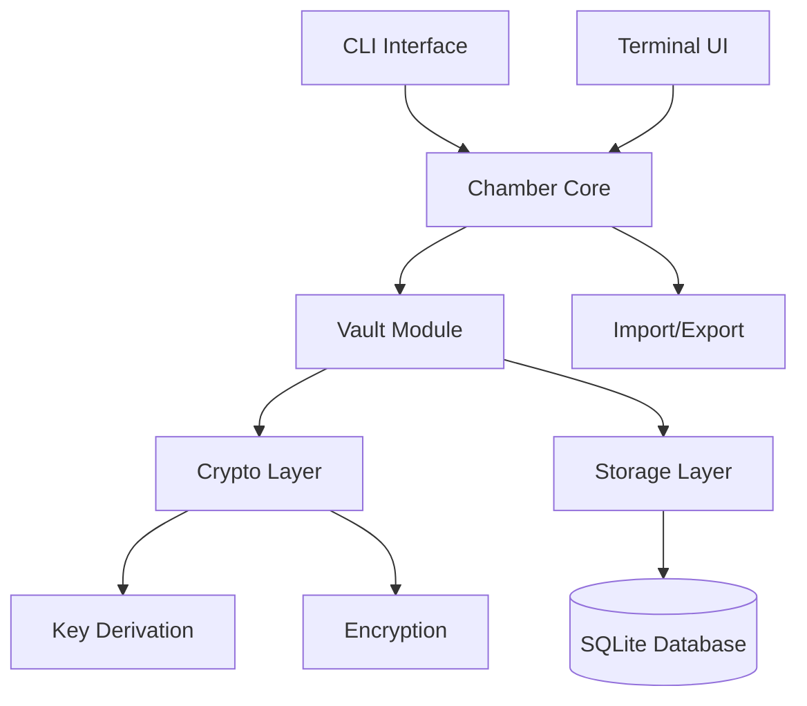
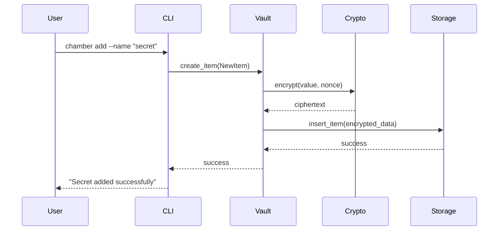

# Chamber
A secure, local-first secrets manager built with Rust, featuring encrypted storage, intuitive terminal UI, and comprehensive import/export capabilities.


[](https://codecov.io/gh/mikeleppane/visualvault)
[](https://codspeed.io/CodSpeedHQ/codspeed-rust)


## 🌟 Overview
Chamber is a modern secret management solution designed for developers and security-conscious users who need reliable, encrypted storage for sensitive information. Built entirely in Rust, Chamber provides a robust foundation for managing passwords, API keys, certificates, database credentials, and other secrets with strong cryptographic guarantees.
### ✨ Features
- **🔐 Strong Encryption**: ChaCha20-Poly1305 authenticated encryption with Argon2 key derivation
- **💾 SQLite Backend**: Reliable, ACID-compliant storage with WAL mode and foreign key constraints
- **📱 Terminal UI**: Beautiful, responsive interface built with Ratatui and Crossterm
- **📊 Multiple Export Formats**: JSON, CSV, and Chamber Backup formats with robust parsing
- **🔄 Import/Export**: Seamless data migration and backup capabilities
- **🏷️ Flexible Item Types**: Support for passwords, environment variables, API keys, SSH keys, certificates, and more
- **🛡️ Security-First Design**: Zero-knowledge architecture with local-only storage

### 📸 Screenshots


### 🎥 Introduction Videos


## 📚 Table of Contents
- [Getting Started](#getting-started)
- [Development Setup](#development-setup)
- [Architecture](#architecture)
- [Usage](#usage)
- [Testing](#testing)
- [Security](#security)
- [Contributing](#contributing)
- [License](#license)

## 🚀 Getting Started
### Prerequisites
- **Rust**: Version 1.89.0 or newer
- **Operating System**: Windows 11, macOS, or Linux
- **Terminal**: Modern terminal with Unicode support (recommended)

### Installation
#### From Source
``` bash
# Clone the repository
git clone https://github.com/your-org/chamber.git
cd chamber

# Build the project
cargo build --release

# Run Chamber
./target/release/chamber
```
#### Using Cargo
``` bash
# Install directly from Git
cargo install --git https://github.com/your-org/chamber.git

# Run Chamber
chamber
```
### Quick Start
1. **Initialize a new vault**:
``` bash
   chamber init
```
1. **Create your first secret**:
``` bash
   chamber add --name "github-token" --kind apikey --value "your-token-here"
```
1. **List your secrets**:
``` bash
   chamber list
```
1. **Launch the interactive UI**:
``` bash
   chamber ui
```
## Development Setup
### Environment Setup
1. **Install Rust toolchain**:
``` bash
   curl --proto '=https' --tlsv1.2 -sSf https://sh.rustup.rs | sh
   rustup update
```
1. **Clone and setup the project**:
``` bash
   git clone https://github.com/your-org/chamber.git
   cd chamber
   
   # Install development dependencies
   cargo install cargo-nextest cargo-watch
```
1. **Verify installation**:
``` bash
   cargo check --all-targets
   cargo test
```
### Development Workflow
``` bash
# Watch for changes and run tests
cargo watch -x "test --all-features"

# Format code
cargo fmt

# Run linter
cargo clippy --all-targets --all-features -D warnings

# Run tests with detailed output
cargo nextest run
```
### Project Structure
``` 
chamber/
├── crates/
│   ├── vault/           # Core vault logic and crypto
│   ├── cli/             # Command-line interface
│   ├── tui/             # Terminal user interface
│   └── import-export/   # Data serialization utilities
├── src/                 # Main binary
├── tests/              # Integration tests
├── docs/               # Additional documentation
└── examples/           # Usage examples
```
## Architecture
Chamber follows a modular architecture with clear separation of concerns:

### Core Components
#### Vault Module (`crates/vault`)
- **Purpose**: Core business logic and data models
- **Key Types**: , , , `Vault``Item``ItemKind``NewItem`
- **Responsibilities**:
  - Vault lifecycle management (create, initialize, unlock)
  - CRUD operations for secrets
  - Master key rotation
  - Data encryption/decryption

#### Crypto Layer
- **Key Derivation**: Argon2id with configurable parameters
- **Encryption**: ChaCha20-Poly1305 AEAD with random nonces
- **Authentication**: HMAC-SHA256 for integrity verification
- **Memory Safety**: Automatic zeroization of sensitive data

#### Storage Layer
- : SQLite with WAL mode for better concurrency **Database**
- **Schema**:
  - : Stores encrypted vault key and KDF parameters `meta`
  - : Encrypted secrets with metadata `items`

- **Features**: ACID transactions, foreign key constraints, automatic migrations

#### Terminal UI (`crates/tui`)
- **Framework**: Ratatui for cross-platform terminal interfaces
- **Features**:
  - Interactive secret management
  - Real-time search and filtering
  - Secure password input
  - Clipboard integration

### Data Flow

### Security Model
``` mermaid
flowchart TD
    A[Master Password] --> B[Argon2 KDF]
    B --> C[Master Key]
    C --> D[Decrypt Vault Key]
    D --> E[Vault Key]
    E --> F[Encrypt/Decrypt Items]
    
    G[Item Data] --> H[Associated Data]
    H --> I[name || kind]
    I --> F
    F --> J[ChaCha20-Poly1305]
    J --> K[Encrypted Item]
```
## 🛠️ Usage
### Command Line Interface
Chamber provides a comprehensive CLI for all operations:
``` bash
# Initialize a new vault
chamber init [--path /custom/path]

# Add a secret
chamber add --name "api-key" --kind apikey --value "secret-value"

# List all secrets
chamber list [--kind password]

# Get a specific secret
chamber get "api-key"

# Update a secret
chamber update "api-key" --value "new-value"

# Delete a secret
chamber delete "api-key"

# Export data
chamber export --format json --output backup.json

# Import data
chamber import --format csv --input data.csv

# Change master password
chamber change-password
```
### Terminal User Interface
Launch the interactive TUI with:
``` bash
chamber ui
```
**TUI Features:**
- Navigate with arrow keys or vim-style bindings
- Search secrets with `/`
- Add new secrets with `a`
- Edit secrets with `e`
- Delete secrets with `d`
- Copy to clipboard with `c`
- Quit with `q`

### Supported Item Types
Chamber supports various types of secrets with intelligent parsing:

| Type | Aliases | Description |
| --- | --- | --- |
| `password` | , `pwd` `pass` | User passwords |
| `apikey` | , `token` `api-key` | API tokens and keys |
| `envvar` | , `environment` `env` | Environment variables |
| `sshkey` | `ssh`, `ssh-key` | SSH private keys |
| `certificate` | `cert`, `ssl`, `tls` | SSL/TLS certificates |
| `database` | , `db``connection` | Database credentials |
| `note` | - | General text notes |
### Import/Export Formats
#### JSON Format
``` json
[
  {
    "name": "github-token",
    "kind": "apikey",
    "value": "ghp_xxxxxxxxxxxx",
    "created_at": "2024-01-15T10:30:00Z",
    "updated_at": "2024-01-15T10:30:00Z"
  }
]
```
#### CSV Format
``` csv
name,kind,value,created_at,updated_at
"github-token","apikey","ghp_xxxxxxxxxxxx","2024-01-15T10:30:00Z","2024-01-15T10:30:00Z"
```
#### Chamber Backup Format
``` json
{
  "version": "1.0",
  "exported_at": "2024-01-15T10:30:00Z",
  "item_count": 1,
  "items": [
    {
      "name": "github-token",
      "kind": "apikey",
      "value": "ghp_xxxxxxxxxxxx",
      "created_at": "2024-01-15T10:30:00Z",
      "updated_at": "2024-01-15T10:30:00Z"
    }
  ]
}
```
## 🧪 Testing
Chamber includes comprehensive test coverage across all components:
### Running Tests
``` bash
# Run all tests
cargo test

# Run tests with detailed output
cargo nextest run

# Run specific test suite
cargo test --package chamber-vault

# Run integration tests
cargo test --test integration

# Generate coverage report
cargo tarpaulin --out html
```
### Test Categories
- **Unit Tests**: Test individual functions and modules
- **Integration Tests**: Test component interactions
- **Cryptographic Tests**: Verify encryption/decryption correctness
- **Database Tests**: Test SQLite operations and migrations
- **CLI Tests**: Test command-line interface behavior

### Performance Tests
``` bash
# Benchmark cryptographic operations
cargo bench --bench crypto

# Benchmark database operations
cargo bench --bench storage

# Profile memory usage
cargo run --bin chamber --features profiling
```
## Security
### Cryptographic Specifications
- **Key Derivation**: Argon2id with minimum 64MB memory, 3 iterations
- **Encryption**: ChaCha20-Poly1305 with 256-bit keys and 96-bit nonces
- **Authentication**: HMAC-SHA256 for integrity verification
- **Random Number Generation**: OS-provided entropy via `getrandom`

### Security Best Practices
1. **Master Password**: Use a strong, unique master password
2. **Storage**: Vault files are stored locally only
3. **Memory**: Sensitive data is zeroized after use
4. **Backups**: Export files contain plaintext - handle with care
5. **Updates**: Keep Chamber updated for security patches

### Threat Model
**Protected Against:**
- Disk-based attacks (encrypted at rest)
- Memory dumps (key zeroization)
- Database tampering (authenticated encryption)
- Offline brute-force (strong KDF)

**Not Protected Against:**
- Malware with root access
- Hardware keyloggers
- Shoulder surfing during password entry
- Side-channel attacks on the host system

## 🤝 Contributing
We welcome contributions! Please see our [Contributing Guide](CONTRIBUTING.md) for details.
### Development Process
1. Fork the repository
2. Create a feature branch: `git checkout -b feature/amazing-feature`
3. Make your changes and add tests
4. Ensure all tests pass: `cargo test`
5. Format code: `cargo fmt`
6. Run linter: `cargo clippy`
7. Commit changes: `git commit -m "Add amazing feature"`
8. Push to branch: `git push origin feature/amazing-feature`
9. Open a Pull Request

### Code Style
- Follow standard Rust formatting (`cargo fmt`)
- Use meaningful variable and function names
- Add documentation for public APIs
- Include tests for new functionality
- Keep commits atomic and well-described

## 🤝 Community

[](CODE_OF_CONDUCT.md)

We have a [Code of Conduct](CODE_OF_CONDUCT.md) that all contributors and participants are expected to follow.

## ⚖️ License
This project is licensed under the MIT License - see the [LICENSE](LICENSE) file for details.

## 🙏 Acknowledgments

- built with Ratatui - Terminal UI framework

<p align="center"> Written with ❤️ in Rust & built with Ratatui </p>

