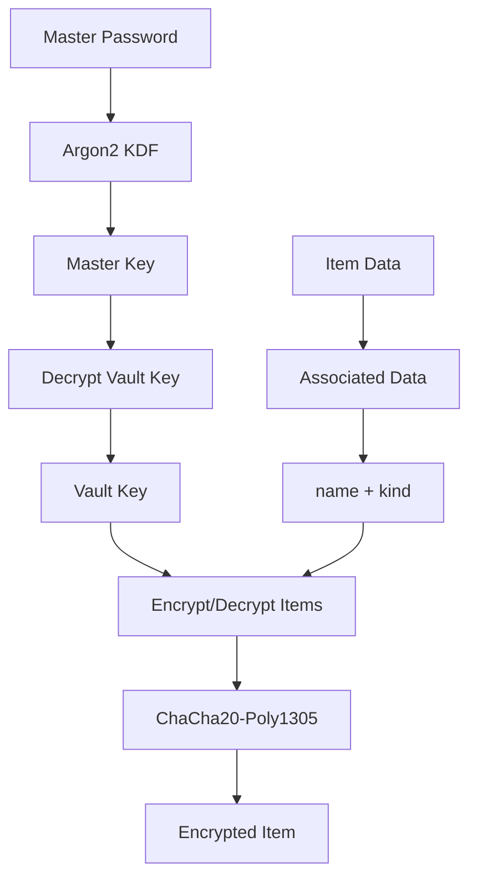

# Chamber
A secure, local-first secrets manager built with Rust, featuring encrypted storage, intuitive terminal UI, 
and comprehensive import/export capabilities.


[](https://codecov.io/gh/mikeleppane/chamber)
[](https://codspeed.io/CodSpeedHQ/codspeed-rust)


## 🌟 Overview
Chamber is a modern secret management solution designed for developers and security-conscious users who need reliable, 
encrypted storage for sensitive information. Built entirely in Rust, Chamber provides a robust foundation for 
managing passwords, API keys, certificates, database credentials, 
and other secrets with strong cryptographic guarantees.
### ✨ Features
- **🔐 Strong Encryption**: ChaCha20-Poly1305 authenticated encryption with Argon2 key derivation
- **💾 SQLite Backend**: Reliable, ACID-compliant storage with WAL mode and foreign key constraints
- **📱 Terminal UI**: Beautiful, responsive interface built with Ratatui and Crossterm
- **📊 Multiple Export Formats**: JSON, CSV, and Chamber Backup formats with robust parsing
- **🔄 Backup**: a comprehensive backup system that ensures your sensitive data is automatically protected
- **🔄 Import/Export**: Seamless data migration and backup capabilities
- **🏷️ Flexible Item Types**: Support for passwords, environment variables, API keys, SSH keys, certificates, and more
- **🛡️ Security-First Design**: Zero-knowledge architecture with local-only storage

### 📸 Screenshots

<p align="center">
  
  <span>Chamber's Main Page with Items</span>
</p>

<p align="center">
  
  <span>Chamber's Add Item Dialog</span>
</p>

<p align="center">
  
  <span>Chamber's Main Page</span>
</p>

<p align="center">
  
  <span>Chamber's Login Page</span>
</p>

### 🎥 Introduction Videos
[](https://youtu.be/iuYMKGDuZW8)

<p align="center">
  <i>Click the image above to watch a quick introduction to Chamber</i>
</p>

## 📚 Table of Contents
- [Getting Started](#-getting-started)
- [Development Setup](#-development-setup)
- [Architecture](#-architecture)
- [Usage](#-usage)
- [Testing](#-testing)
- [Security](#-security)
- [Contributing](#-contributing)
- [License](#-license)

## 🚀 Getting Started
### Prerequisites
- **Rust**: Version 1.89.0 or newer
- **Operating System**: Windows 11, macOS, or Linux
- **Terminal**: Modern terminal with Unicode support (recommended)

### Installation
#### From Source
``` bash
# Clone the repository
git clone https://github.com/your-org/chamber.git
cd chamber

# Build the project
cargo build --release

# Run Chamber
./target/release/chamber
```
#### Using Cargo
``` bash
# Install directly from Git
cargo install --git https://github.com/your-org/chamber.git

# Run Chamber
chamber
```
### Quick Start
1. **Initialize a new vault**:
``` bash
   chamber init
```
1. **Create your first secret**:
``` bash
   chamber add --name "github-token" --kind apikey --value "your-token-here"
```
1. **List your secrets**:
``` bash
   chamber list
```
1. **Launch the interactive UI**:
``` bash
   chamber ui
```
## 🛠️ Development Setup
### Environment Setup
1. **Install Rust toolchain**:
``` bash
   curl --proto '=https' --tlsv1.2 -sSf https://sh.rustup.rs | sh
   rustup update
```
1. **Clone and setup the project**:
``` bash
   git clone https://github.com/your-org/chamber.git
   cd chamber
   
   # Install development dependencies
   cargo install cargo-nextest cargo-watch
```
1. **Verify installation**:
``` bash
   cargo check --all-targets
   cargo test
```
### Development Workflow
``` bash
# Watch for changes and run tests
cargo watch -x "test --all-features"

# Format code
cargo fmt

# Run linter
cargo clippy --all-targets --all-features -D warnings

# Run tests with detailed output
cargo nextest run
```
### Project Structure
``` text
chamber/
├── crates/
│   ├── vault/           # Core vault logic and crypto
│   ├── cli/             # Command-line interface
│   ├── tui/             # Terminal user interface
│   └── import-export/   # Data serialization utilities
├── src/                 # Main binary
├── tests/              # Integration tests
├── docs/               # Additional documentation
└── examples/           # Usage examples
```
## 🏗️ Architecture
Chamber follows a modular architecture with clear separation of concerns:

### Core Components
#### Vault Module (`crates/vault`)
- **Purpose**: Core business logic and data models
- **Key Types**: `Vault`,`Item`,`ItemKind`,`NewItem`
- **Responsibilities**:
  - Vault lifecycle management (create, initialize, unlock)
  - CRUD operations for secrets
  - Master key rotation
  - Data encryption/decryption

#### Crypto Layer
- **Key Derivation**: Argon2id with configurable parameters
- **Encryption**: ChaCha20-Poly1305 AEAD with random nonces
- **Authentication**: HMAC-SHA256 for integrity verification
- **Memory Safety**: Automatic zeroization of sensitive data

#### Storage Layer
- : SQLite with WAL mode for better concurrency **Database**
- **Schema**:
  - : Stores encrypted vault key and KDF parameters `meta`
  - : Encrypted secrets with metadata `items`

- **Features**: ACID transactions, foreign key constraints, automatic migrations

#### Terminal UI (`crates/tui`)
- **Framework**: Ratatui for cross-platform terminal interfaces
- **Features**:
  - Interactive secret management
  - Real-time search and filtering
  - Secure password input
  - Clipboard integration

### Data Flow

### Security Model


## 🛠️ Usage
### Command Line Interface
Chamber provides a comprehensive CLI for all operations:
``` bash
# Initialize a new vault
chamber init [--path /custom/path]

# Add a secret
chamber add --name "api-key" --kind apikey --value "secret-value"

# List all secrets
chamber list [--kind password]

# Get a specific secret
chamber get "api-key"

# Update a secret
chamber update "api-key" --value "new-value"

# Delete a secret
chamber delete "api-key"

# Export data
chamber export --format json --output backup.json

# Import data
chamber import --format csv --input data.csv

# Change master password
chamber change-password
```
### Terminal User Interface
Launch the interactive TUI with:
``` bash
chamber ui
```
**TUI Features:**
- Navigate with arrow keys or vim-style bindings
- Search secrets with `/`
- Add new secrets with `a`
- Edit secrets with `e`
- Delete secrets with `d`
- Copy to clipboard with `c`
- Quit with `q`

### Supported Item Types
Chamber supports various types of secrets with intelligent parsing:

| Type | Aliases | Description |
| --- | --- | --- |
| `password` | , `pwd` `pass` | User passwords |
| `apikey` | , `token` `api-key` | API tokens and keys |
| `envvar` | , `environment` `env` | Environment variables |
| `sshkey` | `ssh`, `ssh-key` | SSH private keys |
| `certificate` | `cert`, `ssl`, `tls` | SSL/TLS certificates |
| `database` | , `db``connection` | Database credentials |
| `note` | - | General text notes |
### Import/Export Formats
#### JSON Format
``` json
[
  {
    "name": "github-token",
    "kind": "apikey",
    "value": "ghp_xxxxxxxxxxxx",
    "created_at": "2024-01-15T10:30:00Z",
    "updated_at": "2024-01-15T10:30:00Z"
  }
]
```
#### CSV Format
``` csv
name,kind,value,created_at,updated_at
"github-token","apikey","ghp_xxxxxxxxxxxx","2024-01-15T10:30:00Z","2024-01-15T10:30:00Z"
```
#### Chamber Backup Format
``` json
{
  "version": "1.0",
  "exported_at": "2024-01-15T10:30:00Z",
  "item_count": 1,
  "items": [
    {
      "name": "github-token",
      "kind": "apikey",
      "value": "ghp_xxxxxxxxxxxx",
      "created_at": "2024-01-15T10:30:00Z",
      "updated_at": "2024-01-15T10:30:00Z"
    }
  ]
}
```

## Chamber Backup System
Chamber provides a comprehensive backup system that ensures your sensitive data is automatically protected with configurable retention policies, multiple export formats, and integrity verification.
### 🔄 Backup Features
#### **Automated Backup System**
- **Scheduled Backups**: Configurable interval-based automatic backups (hourly, daily, weekly)
- **Background Service**: Non-intrusive background process that runs backup checks
- **Smart Scheduling**: Only creates backups when needed based on your configured interval
- **Retention Management**: Automatic cleanup of old backups with configurable retention limits

#### **Multiple Export Formats**
- **JSON**: Human-readable structured data format
- **CSV**: Spreadsheet-compatible format for easy viewing and manipulation
- **Chamber Backup**: Enhanced format with metadata including version info and export timestamps

#### **Data Integrity & Security**
- **Compression**: Optional gzip compression to reduce backup file sizes
- **Verification**: Automatic backup integrity verification after creation
- **Timestamped Files**: Each backup includes precise timestamp for easy identification
- **Format Detection**: Automatic format detection based on file extensions and content

### 🚀 Quick Start
#### Enable Automatic Backups
``` bash
# Enable daily backups with 7-day retention
chamber backup configure --enable true --interval 24 --max-backups 7

# Set custom backup directory
chamber backup configure --backup-dir ~/.chamber/backups

# Enable compression and verification
chamber backup configure --compress true --verify true
```
#### Manual Backup Operations
``` bash
# Create a backup immediately
chamber backup now

# Force backup even if one was recently created
chamber backup now --force

# Create backup with custom output location
chamber backup now --output /path/to/custom/backup.json
```
#### Backup Management
``` bash
# List all existing backups
chamber backup list

# Show detailed backup information
chamber backup list --verbose

# Check current backup status and configuration
chamber backup status

# Verify a backup file's integrity
chamber backup verify /path/to/backup.json
```
#### Data Recovery
``` bash
# Restore from a backup file
chamber backup restore /path/to/backup.json

# Skip confirmation prompt (use with caution)
chamber backup restore /path/to/backup.json --yes
```
#### Maintenance
``` bash
# Clean up old backups manually
chamber backup cleanup

# Preview what would be deleted (dry run)
chamber backup cleanup --dry-run

# Keep only 3 most recent backups
chamber backup cleanup --keep 3
```
### ⚙️ Configuration Options
#### Backup Settings

| Setting | Default | Description |
| --- | --- | --- |
| `enabled` | `false` | Enable/disable automatic backups |
| `interval` | `24` hours | How often to create backups |
| `max_backups` | `7` | Maximum number of backups to retain |
| `backup_dir` | `~/.chamber/backups` | Directory to store backup files |
| `format` | `backup` | Export format (, , ) `json``csv``backup` |
| `compress` | `true` | Enable gzip compression |
| `verify` | `true` | Verify backup integrity after creation |
#### Configuration Examples
``` bash
# Professional setup - frequent backups with long retention
chamber backup configure \
  --enable true \
  --interval 6 \
  --max-backups 28 \
  --format backup \
  --compress true \
  --verify true

# Minimal setup - daily backups with short retention
chamber backup configure \
  --enable true \
  --interval 24 \
  --max-backups 3 \
  --format json \
  --compress false

# Development setup - CSV format for easy inspection
chamber backup configure \
  --enable true \
  --interval 12 \
  --max-backups 5 \
  --format csv \
  --backup-dir ./backups
```
### 📁 Backup File Format
#### Filename Convention
Backups use a standardized naming convention:
``` 
chamber_backup_YYYY-MM-DD_HH-MM-SSZ_TIMESTAMP.format[.gz]
```
Examples:
- `chamber_backup_2024-01-15_14-30-00Z_1705327800.backup.gz`
- `chamber_backup_2024-01-15_14-30-00Z_1705327800.json`
- `chamber_backup_2024-01-15_14-30-00Z_1705327800.csv.gz`

#### Chamber Backup Format
The enhanced Chamber backup format includes metadata:
``` json
{
  "version": "1.0",
  "exported_at": "2024-01-15T14:30:00Z",
  "item_count": 42,
  "items": [
    {
      "name": "github-token",
      "kind": "apikey",
      "value": "ghp_xxxxxxxxxxxx",
      "created_at": "2024-01-15T10:30:00Z",
      "updated_at": "2024-01-15T10:30:00Z"
    }
  ]
}
```
### 🔧 Background Service
When automatic backups are enabled, Chamber runs a lightweight background service that:
1. **Checks backup schedule** every hour
2. **Creates backups** when the configured interval has passed
3. **Verifies backup integrity** (if enabled)
4. **Applies compression** (if enabled)
5. **Manages retention** by cleaning up old backups
6. **Logs errors** to help diagnose issues

The background service is automatically started when you launch the TUI mode with backups enabled.
### 🛡️ Security Considerations
#### Data Protection
- **Encrypted at Rest**: Your vault data remains encrypted; backups export the decrypted secrets
- **Local Storage**: Backups are stored locally, maintaining Chamber's zero-knowledge architecture
- **File Permissions**: Backup files inherit your system's file permissions
- **Master Password**: You must enter your master password to create or restore backups

### Best Practices
- **Secure Backup Location**: Store backups in a secure location (encrypted drive, secure cloud storage)
- **Regular Testing**: Periodically test backup restoration to ensure data integrity
- **Access Control**: Limit access to backup files using appropriate file system permissions
- **Offsite Storage**: Consider copying backups to offsite locations for disaster recovery

### 📊 Backup Status and Monitoring
#### Status Command Output
``` bash
$ chamber backup status
🔒 Backup Configuration Status
━━━━━━━━━━━━━━━━━━━━━━━━━━━━━━━━━━
   Status: ✅ Enabled
   Directory: /home/user/.chamber/backups
   Interval: 24 hours
   Max backups: 7
   Format: backup
   Compression: ✅ Enabled
   Verification: ✅ Enabled

📁 Most Recent Backup:
   File: chamber_backup_2024-01-15_14-30-00Z_1705327800.backup.gz
   Date: 2024-01-15 14:30:00 UTC
   Size: 2048 bytes
```
#### Listing Backups
``` bash
$ chamber backup list --verbose
Found 7 backup(s):

1. chamber_backup_2024-01-15_14-30-00Z_1705327800.backup.gz
   Path: /home/user/.chamber/backups/chamber_backup_2024-01-15_14-30-00Z_1705327800.backup.gz
   Size: 2048 bytes (0.00 MB)
   Date: 2024-01-15 14:30:00 UTC
   Timestamp: 2024-01-15T14:30:00Z

2. chamber_backup_2024-01-14_14-30-00Z_1705241400.backup.gz
   Path: /home/user/.chamber/backups/chamber_backup_2024-01-14_14-30-00Z_1705241400.backup.gz
   Size: 1987 bytes (0.00 MB)
   Date: 2024-01-14 14:30:00 UTC
   Timestamp: 2024-01-14T14:30:00Z
```

## 🧪 Testing
Chamber includes comprehensive test coverage across all components:
### Running Tests
``` bash
# Run all tests
cargo test

# Run tests with detailed output
cargo nextest run

# Run specific test suite
cargo test --package chamber-vault

# Run integration tests
cargo test --test integration

# Generate coverage report
cargo tarpaulin --out html
```
### Test Categories
- **Unit Tests**: Test individual functions and modules
- **Integration Tests**: Test component interactions
- **Cryptographic Tests**: Verify encryption/decryption correctness
- **Database Tests**: Test SQLite operations and migrations
- **CLI Tests**: Test command-line interface behavior

### Performance Tests
``` bash
# Benchmark cryptographic operations
cargo bench --bench crypto

# Benchmark database operations
cargo bench --bench storage

# Profile memory usage
cargo run --bin chamber --features profiling
```
## 🛡️ Security
### Cryptographic Specifications
- **Key Derivation**: Argon2id with minimum 64MB memory, 3 iterations
- **Encryption**: ChaCha20-Poly1305 with 256-bit keys and 96-bit nonces
- **Authentication**: HMAC-SHA256 for integrity verification
- **Random Number Generation**: OS-provided entropy via `getrandom`

### Security Best Practices
1. **Master Password**: Use a strong, unique master password
2. **Storage**: Vault files are stored locally only
3. **Memory**: Sensitive data is zeroized after use
4. **Backups**: Export files contain plaintext - handle with care
5. **Updates**: Keep Chamber updated for security patches

### Threat Model
**Protected Against:**
- Disk-based attacks (encrypted at rest)
- Memory dumps (key zeroization)
- Database tampering (authenticated encryption)
- Offline brute-force (strong KDF)

**Not Protected Against:**
- Malware with root access
- Hardware keyloggers
- Shoulder surfing during password entry
- Side-channel attacks on the host system

## 🤝 Contributing
We welcome contributions! Please see our [Contributing Guide](CONTRIBUTING.md) for details.
### Development Process
1. Fork the repository
2. Create a feature branch: `git checkout -b feature/amazing-feature`
3. Make your changes and add tests
4. Ensure all tests pass: `cargo test`
5. Format code: `cargo fmt`
6. Run linter: `cargo clippy`
7. Commit changes: `git commit -m "Add amazing feature"`
8. Push to branch: `git push origin feature/amazing-feature`
9. Open a Pull Request

### Code Style
- Follow standard Rust formatting (`cargo fmt`)
- Use meaningful variable and function names
- Add documentation for public APIs
- Include tests for new functionality
- Keep commits atomic and well-described

## 🤝 Community

[](CODE_OF_CONDUCT.md)

We have a [Code of Conduct](CODE_OF_CONDUCT.md) that all contributors and participants are expected to follow.

## ⚖️ License
This project is licensed under the MIT License—see the [LICENSE](LICENSE) file for details.

## 🙏 Acknowledgments

- built with Ratatui - Terminal UI framework

<p align="center"> Written with ❤️ in Rust & built with Ratatui </p>

